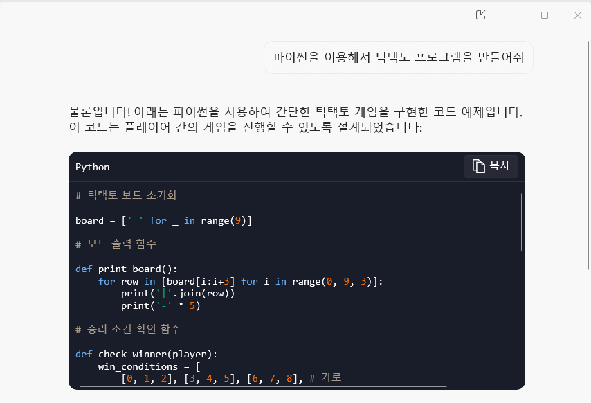
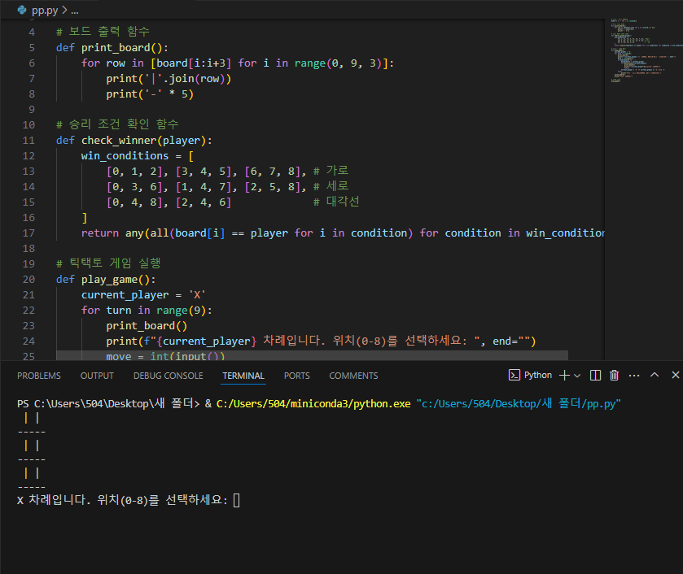
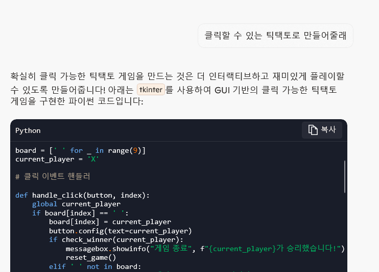
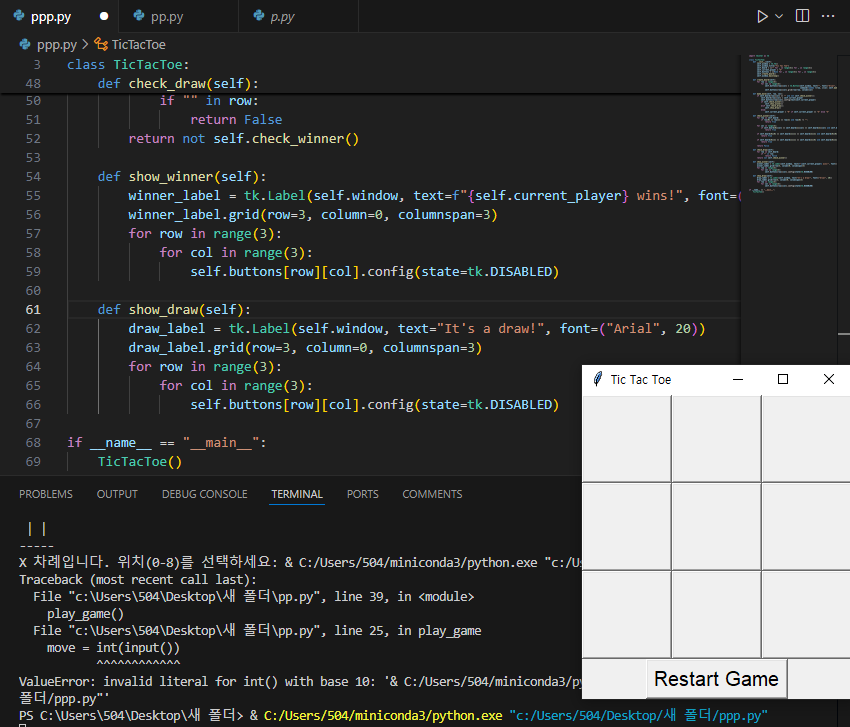
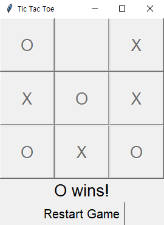

# vscode에 있는 copilot에게 틱택토 프로그램 만드는 것을 질문한다

## 실행시

## 너무 간단하고 밋밋하기 때문에 클릭해서 할 수 있게 만든다.

## 실행시

오른쪽 밑에 보이는 것 처럼 틱택토가 보인다.

이긴 쪽은 이런식으로 뜬다

## 게임 규칙

두 명의 플레이어(X와 O)가 번갈아 가면서 3x3 보드에 표시하고,
가로, 세로, 대각선 중 하나를 먼저 채운 사람이 승리하는 게임
오목과 비슷하다.

